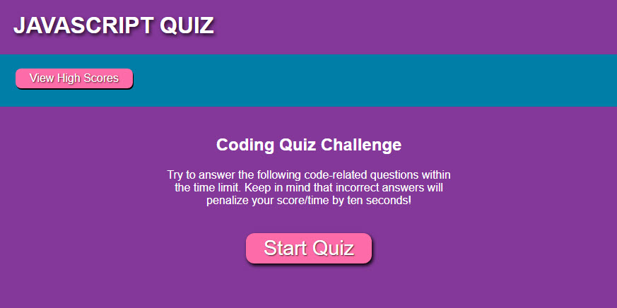
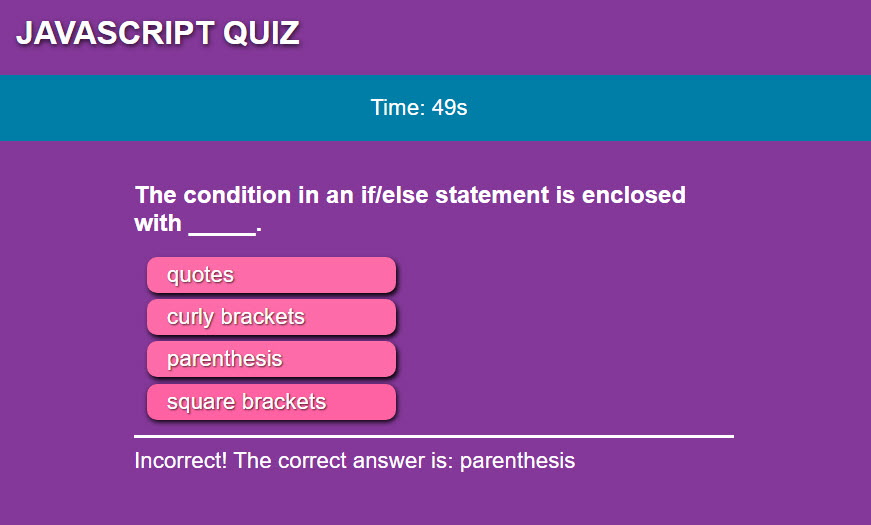

# JavaScript Quiz

## Description

### :question: :exclamation: Test your JavaScript Knowledge

The JavaScript quiz presents you with JavaScript related questions to test how well you know JavaScript. The quiz features:
- Random based questions
- Timer
- Wrong answers deduct from the time
- Final score
- High Score Tracking

## Application

Link to the application:
[JavaScript Quiz](https://yiladien.github.io/javascript-quiz/)

### Application Screens:

